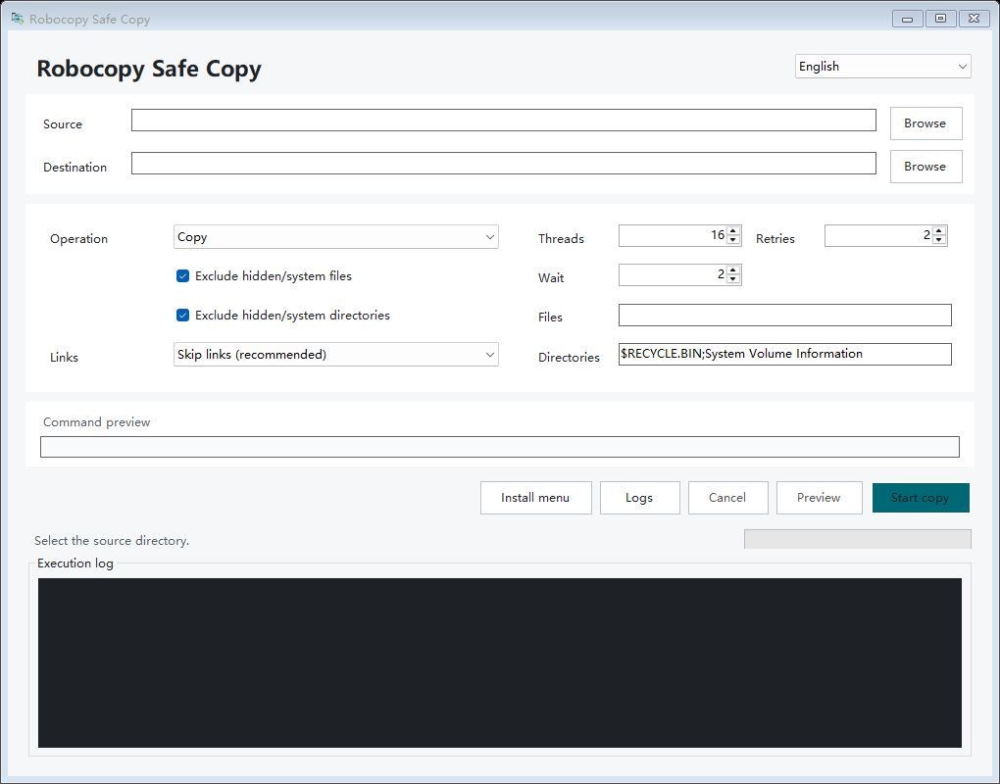

<p align="center">
  
</p>

<h1 align="center">Robocopy Safe Copy</h1>

<p align="center">A small Windows GUI for fast, observable Robocopy jobs with conservative defaults for hidden items, system items, and links.</p>

<p align="center">
  <a href="README.zh-CN.md">简体中文</a> |
  <a href="https://github.com/staolo/RobocopySafeGUI/releases/latest">Download</a> |
  <a href="SECURITY.md">Security</a>
</p>

[](https://github.com/staolo/RobocopySafeGUI/actions/workflows/ci.yml)
[](https://github.com/staolo/RobocopySafeGUI/releases/latest)
[](LICENSE)



## Highlights

- Uses the Windows `robocopy.exe` engine and keeps configurable `/MT` multithreading.
- Keeps the UI responsive by processing output off the UI thread and updating it in batches.
- Shows elapsed time, current-file progress when Robocopy reports it, and a bounded live log.
- Provides copy, move, and real `/L` preview modes.
- Adds a per-user classic Explorer context menu without loading a third-party DLL into Explorer.
- Supports English and Simplified Chinese, following the Windows UI language by default.
- Has no telemetry, update checker, advertising, or network access.

## Download And Install

1. Download the package for `win-x64` or `win-arm64` from [Releases](https://github.com/staolo/RobocopySafeGUI/releases/latest).
2. Compare the ZIP hash with `SHA256SUMS.txt` from the same release.
3. Extract the package to a stable directory and run `RobocopySafeGUI.exe`.
4. Optionally select **Install menu** to add the Explorer context menu for the current user.

Release packages are self-contained and do not require a separate .NET installation. The executable is not code-signed, so Windows SmartScreen may show a warning. Only use packages from this repository's Releases page and verify the checksum before running them.

The context menu stores the executable path in `HKCU`. If the application is moved, run it from the new location and install the menu again. Administrator privileges are neither required nor recommended.

## Safety Defaults

| Area | Behavior |
| --- | --- |
| Hidden/system files | Excluded with `/XA:SH` by default. |
| Hidden/system directories | Scanned before execution and added to `/XD` as top-level full paths. |
| Links and junctions | Skipped with `/XJ /XJD /XJF` by default. |
| Copy link nodes | Explicit mode using `/SJ /SL`; targets are not expanded. |
| Follow link targets | Explicit copy-only mode; move is blocked because it could delete outside the source tree. |
| Source root links | Rejected unless the user explicitly selects copy + follow-target mode. |
| Custom exclusions | Passed through `/XF` and `/XD`; values beginning with `/` are rejected as option-like input. |
| Path relationships | Same source/destination and destinations resolving inside the source through existing links are rejected. |
| Move completion | Source is checked again; unresolved items keep the clipboard entry and are reported. |

This is a safer front end, not a sandbox. Robocopy still has the current user's file permissions. Review the command preview and use **Preview** before unfamiliar or destructive operations. Move mode can delete source files after successful copies.

See [Security model](docs/SECURITY_MODEL.md) for trust boundaries and non-goals.

## Explorer Workflow

The classic context menu is available for selected directories, drive roots, and directory backgrounds:

- **Copy this directory** and **Cut this directory** stage one directory in the Windows file clipboard.
- **Paste into this directory** opens one GUI window with source, destination, and operation populated.
- Standard Explorer `Ctrl+C` / `Ctrl+X` for a single directory can also be pasted through this menu.
- Copying beside the source automatically chooses a `- Copy` destination name.

Windows 10 shows the classic menu directly. On a default Windows 11 configuration it appears under **Show more options**; systems configured to use the classic menu show it directly. This project intentionally uses static per-user shell verbs instead of an `IExplorerCommand` COM extension.

The context-menu workflow currently accepts one directory or drive at a time. Individual files and multi-item queues are outside the current scope.

## Performance And Logs

The copy itself always runs in `robocopy.exe`. UI output is queued and flushed every 100 ms, high-frequency percentage lines update the status area instead of the text log, and old visible text is trimmed in one silent operation. Full meaningful output remains in the disk log.

A local regression run on 2026-07-22 used 15,001 files, 138,057,728 bytes, and `/MT:16`. Two native runs had a 15.573 s median; two GUI runs had a 13.568 s median, with zero unresponsive samples. The apparent `-12.87%` overhead is cache and scheduling noise, not evidence that the GUI is faster. Treat this only as a regression check showing no observable 5-10% penalty in that run, not as a portable performance guarantee.

Data locations:

- Settings: `%LOCALAPPDATA%\RobocopySafeGUI\settings.json`
- Logs: `%LOCALAPPDATA%\RobocopySafeGUI\logs\`
- Context menu: `HKCU\Software\Classes\...\RobocopySafeGUI`

Logs can contain full local file paths. Review them before sharing publicly.

## Command Line

```text
RobocopySafeGUI.exe [--source <path>] [--destination <path>] [--mode copy|move]
RobocopySafeGUI.exe --install-context-menu
RobocopySafeGUI.exe --uninstall-context-menu
RobocopySafeGUI.exe --help
RobocopySafeGUI.exe --version
```

Robocopy exit codes `0` through `7` do not indicate a copy failure. Codes `8` and above indicate at least one failure.

## Build

Requirements: Windows 10/11 and the .NET 10 SDK.

```powershell
dotnet restore .\RobocopySafeGUI.sln
dotnet build .\RobocopySafeGUI.sln -c Release --no-restore
dotnet run --project .\tests\RobocopySafe.Harness\RobocopySafe.Harness.csproj -c Release --no-build
dotnet format .\RobocopySafeGUI.sln --verify-no-changes --no-restore
```

Create self-contained release ZIPs:

```powershell
pwsh -NoProfile -File .\tools\build-release.ps1 -Version 1.0.0
```

The integration harness creates junctions and temporary test trees only under the ignored `artifacts/` directory.

## Attribution

The workflow was inspired by [HO-COOH/FastCopy](https://github.com/HO-COOH/FastCopy). This repository is an independent C# WinForms implementation and is not affiliated with that project. See [Third-party notices](THIRD_PARTY_NOTICES.md).

## License

Robocopy Safe Copy is released under the [MIT License](LICENSE).
