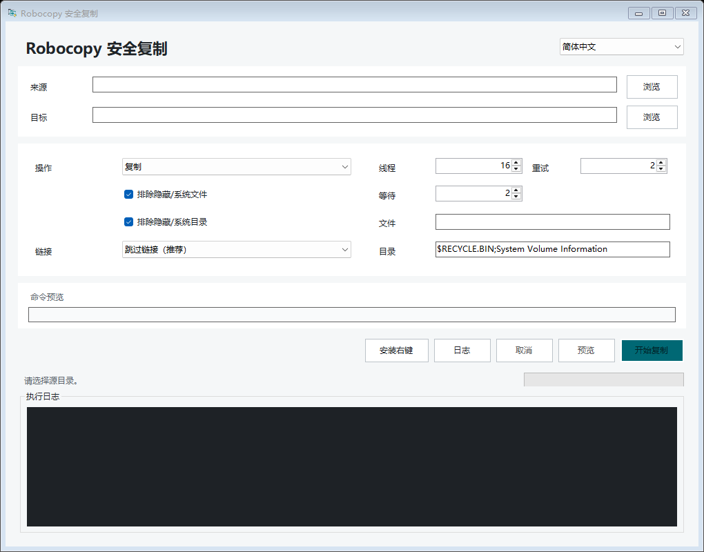

<p align="center">
  
</p>

<h1 align="center">Robocopy 安全复制</h1>

<p align="center">面向 Windows 的轻量 Robocopy 图形界面，在保留多线程性能的同时，对隐藏项目、系统项目和链接采用保守默认值。</p>

<p align="center">
  <a href="README.md">English</a> |
  <a href="https://github.com/staolo/RobocopySafeGUI/releases/latest">下载</a> |
  <a href="SECURITY.md">安全说明</a>
</p>

[](https://github.com/staolo/RobocopySafeGUI/actions/workflows/ci.yml)
[](https://github.com/staolo/RobocopySafeGUI/releases/latest)
[](LICENSE)



## 主要功能

- 复制工作由 Windows 自带的 `robocopy.exe` 执行，保留可配置的 `/MT` 多线程复制。
- 后台读取输出并批量刷新界面，避免多文件任务阻塞 UI。
- 显示耗时、Robocopy 能提供时的当前文件进度，以及有容量上限的实时日志。
- 支持复制、移动和真实的 `/L` 预览。
- 为当前用户安装经典资源管理器右键菜单，不向 Explorer 进程加载第三方 DLL。
- 支持英文和简体中文，默认跟随 Windows 界面语言，也可手动切换。
- 不包含遥测、更新检查、广告或任何联网功能。

## 下载与安装

1. 从 [Releases](https://github.com/staolo/RobocopySafeGUI/releases/latest) 下载 `win-x64` 或 `win-arm64` 压缩包。
2. 使用同一 Release 中的 `SHA256SUMS.txt` 核对 ZIP 哈希。
3. 解压到稳定目录，运行 `RobocopySafeGUI.exe`。
4. 如需右键功能，在程序内点击“安装右键”。

Release 压缩包为自包含版本，无需另装 .NET。当前可执行文件没有代码签名，因此 Windows SmartScreen 可能提示风险。请只使用本仓库 Releases 页面中的文件，并在运行前核对哈希。

右键菜单会把可执行文件路径写入当前用户的 `HKCU`。移动程序后，需要在新位置重新安装右键菜单。不需要也不建议以管理员身份运行。

## 安全默认值

| 范围 | 行为 |
| --- | --- |
| 隐藏/系统文件 | 默认使用 `/XA:SH` 排除。 |
| 隐藏/系统目录 | 执行前扫描，把最上层匹配目录的完整路径加入 `/XD`。 |
| 链接与联接点 | 默认使用 `/XJ /XJD /XJF` 跳过。 |
| 复制链接节点 | 明确选择后使用 `/SJ /SL`，不展开目标内容。 |
| 跟随链接目标 | 只允许明确选择的复制操作；移动时会阻止，以免删除源树外内容。 |
| 源根目录为链接 | 除非明确选择“复制 + 跟随链接目标”，否则拒绝执行。 |
| 自定义排除项 | 通过 `/XF` 和 `/XD` 传入；以 `/` 开头的疑似命令开关会被拒绝。 |
| 路径关系 | 禁止源和目标相同；解析已有链接后实际位于源目录内部的目标也会被拒绝。 |
| 移动收尾 | 再次检查源目录；存在残留时保留剪贴板并在日志中说明。 |

它是采用更安全默认值的前端，不是沙箱。Robocopy 仍然拥有当前用户的文件权限。面对不熟悉或有破坏性的操作，请先检查命令预览并使用“预览”。移动模式会在复制成功后删除源文件。

信任边界与非目标见[安全模型](docs/SECURITY_MODEL.md)。

## 资源管理器工作流

经典右键菜单支持选中的文件夹、盘符和目录空白处：

- “复制此目录”和“剪切此目录”只把一个目录暂存到 Windows 文件剪贴板。
- 到目标目录选择“粘贴到此目录”后，只打开一个 GUI，并自动填入源、目标和操作模式。
- 也可先用资源管理器 `Ctrl+C` / `Ctrl+X` 处理单个目录，再通过本菜单粘贴。
- 在原位置复制时，目标目录名会自动增加“ - 副本”。

Windows 10 会直接显示经典菜单。Windows 11 默认位于“显示更多选项”，使用经典菜单配置时会直接显示。本项目有意采用当前用户的静态 shell verb，而不是 `IExplorerCommand` COM 扩展。

当前右键工作流一次只处理一个文件夹或盘符；单个文件和多项目队列不在本版本范围内。

## 性能与日志

实际复制始终运行在 `robocopy.exe` 中。界面每 100 ms 批量刷新一次，高频百分比只更新状态区，不重复写入文本日志；较早的可见日志会通过一次无声替换裁剪，完整有效输出仍保留在磁盘日志中。

2026-07-22 的本机回归测试使用 15,001 个文件、138,057,728 字节和 `/MT:16`。两轮原生 Robocopy 中位数为 15.573 秒，两轮 GUI 中位数为 13.568 秒，未发现未响应采样。表观开销 `-12.87%` 来自缓存和调度波动，不代表 GUI 更快；它只能说明该轮测试没有观察到 5%-10% 的性能损耗，不能当作跨机器性能保证。

本地数据位置：

- 设置：`%LOCALAPPDATA%\RobocopySafeGUI\settings.json`
- 日志：`%LOCALAPPDATA%\RobocopySafeGUI\logs\`
- 右键菜单：`HKCU\Software\Classes\...\RobocopySafeGUI`

日志可能包含完整本地文件路径，公开分享前请先检查。

## 命令行

```text
RobocopySafeGUI.exe [--source <路径>] [--destination <路径>] [--mode copy|move]
RobocopySafeGUI.exe --install-context-menu
RobocopySafeGUI.exe --uninstall-context-menu
RobocopySafeGUI.exe --help
RobocopySafeGUI.exe --version
```

Robocopy 返回码 `0` 到 `7` 不表示复制失败，`8` 及以上表示至少有一项失败。

## 构建

需要 Windows 10/11 和 .NET 10 SDK。

```powershell
dotnet restore .\RobocopySafeGUI.sln
dotnet build .\RobocopySafeGUI.sln -c Release --no-restore
dotnet run --project .\tests\RobocopySafe.Harness\RobocopySafe.Harness.csproj -c Release --no-build
dotnet format .\RobocopySafeGUI.sln --verify-no-changes --no-restore
```

生成自包含 Release 压缩包：

```powershell
pwsh -NoProfile -File .\tools\build-release.ps1 -Version 1.0.0
```

集成测试只会在已忽略的 `artifacts/` 目录内创建联接点和临时测试树。

## 来源说明

工作流设计参考了 [HO-COOH/FastCopy](https://github.com/HO-COOH/FastCopy)。本仓库是独立的 C# WinForms 实现，与上游项目不存在从属或官方关联。详情见[第三方声明](THIRD_PARTY_NOTICES.md)。

## 许可证

Robocopy 安全复制使用 [MIT License](LICENSE)。
